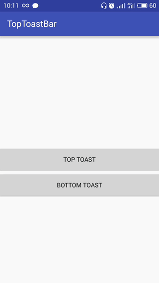

Material Design Top/Bottom Toast Bar.

<h2>How to implement</h2>


Add it in your root build.gradle at the end of repositories:
```gradle
	allprojects {
		repositories {
			...
			maven { url "https://jitpack.io" }
		}
	}
```
Step 2. Add the dependency
```gradle
    dependencies {
	        compile 'com.github.SwiftyWang:ToastBar:release~1.1'
	}
```

Support in the application or in the window.

Toast style to use:

with container view:
```java
    public void onBottomToast(View view) {
        BottomToast.make((ViewGroup) findViewById(R.id.parent), context, "HELLO WORLD!!!!", 3000).show();
    }

    public void onTopToast(View view) {
        TopToast.make((ViewGroup) findViewById(R.id.parent), context, "HELLO WORLD!!!!", 3000).show();
    }
```

without container view(attach as overlay)
```java
    public void onBottomToast(View view) {
        BottomToast.make(context, "HELLO WORLD!!!!", 3000).show();
    }

    public void onTopToast(View view) {
        TopToast.make(context, "HELLO WORLD!!!!", 3000).show();
    }
```
